# LPSE-X System Architecture — Complete Technical Diagrams

**Product:** LPSE-X (Explainable AI for Procurement Fraud Detection)
**Competition:** Find IT! 2026 — Universitas Gadjah Mada
**Track:** C — "The Explainable Oracle" (Predictive Analytics)
**Date:** February 27, 2026

---

## 1. System Overview — High-Level Architecture

The LPSE-X platform is a modular, high-performance system designed for local-only deployment on participant hardware. It integrates 1.1 million tenders through a multi-stage pipeline, leveraging a tri-method AI engine and a five-layer explainability sandwich.

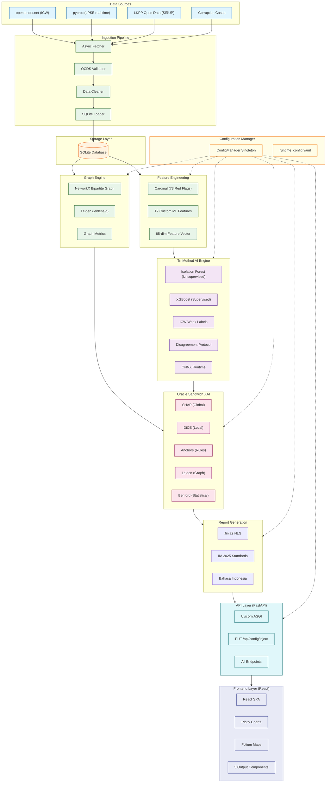

---

## 2. Data Ingestion Pipeline — Detailed Flow

The ingestion pipeline handles 1.1 million tenders with OCDS validation and privacy-preserving NPWP hashing. All data is served from local SQLite after the initial ingestion phase.

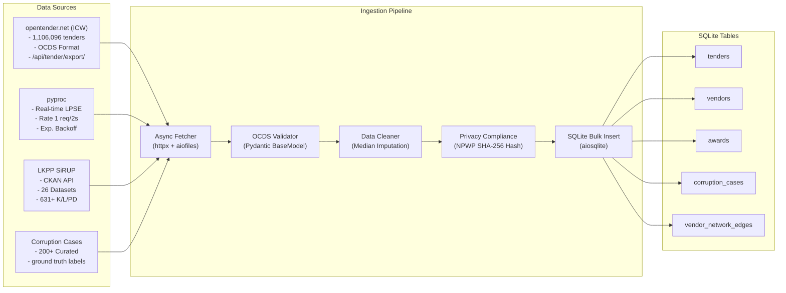

---

## 3. Feature Engineering — 85 Forensic Signals

LPSE-X calculates 85 dimensions of feature data per tender, combining international OCP red flags with 12 custom behavioral forensic signals.

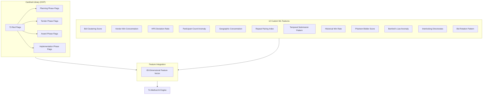

---

## 4. Graph-Based Cartel Detection

Using bipartite graph analysis and the Leiden community detection algorithm to identify suspicious vendor clusters.

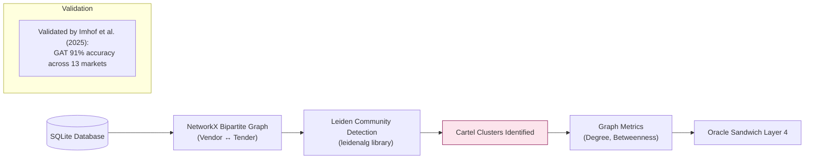

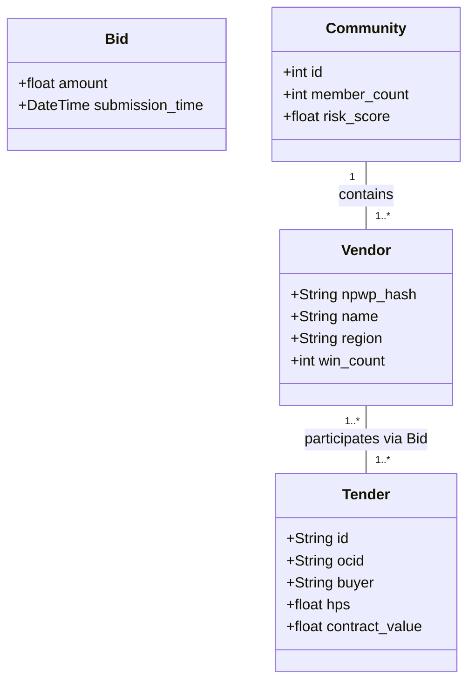

---

## 5. Tri-Method AI Engine

The engine combines three detection methods through a disagreement protocol to ensure high-precision risk scoring.

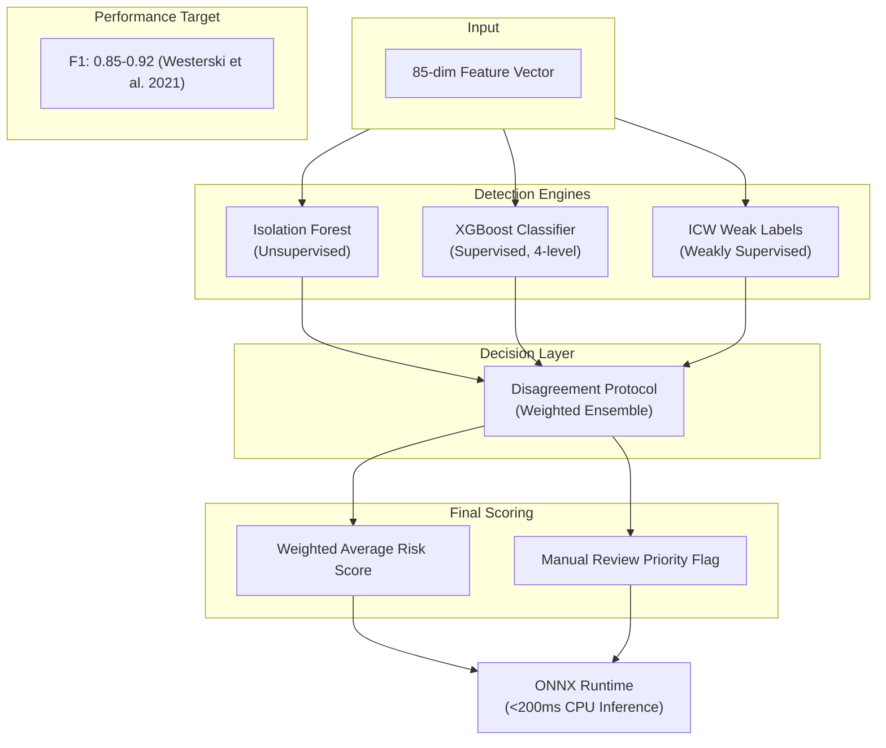

```mermaid
stateDiagram-v2
    [*] --> Aman: score < risk_threshold_low
    Aman --> Perlu_Pantauan: score >= risk_threshold_low
    Perlu_Pantauan --> Risiko_Tinggi: score >= risk_threshold_mid
    Risiko_Tinggi --> Risiko_Kritis: score >= risk_threshold_high
    Risiko_Kritis --> [*]: alert generated

    state Aman {
        label: "Aman"
    }
    state Perlu_Pantauan {
        label: "Perlu Pantauan"
    }
    state Risiko_Tinggi {
        label: "Risiko Tinggi"
    }
    state Risiko_Kritis {
        label: "Risiko Kritis"
    }

    note right of Aman: Labels: Aman, Perlu Pantauan, Risiko Tinggi, Risiko Kritis
    note right of Risiko_Kritis: Configurable via PUT /api/config/inject
```

---

## 6. Oracle Sandwich XAI — 5 Layers

The Oracle Sandwich architecture provides multi-layer explanations, meeting EU AI Act Pasal 86 transparency standards.

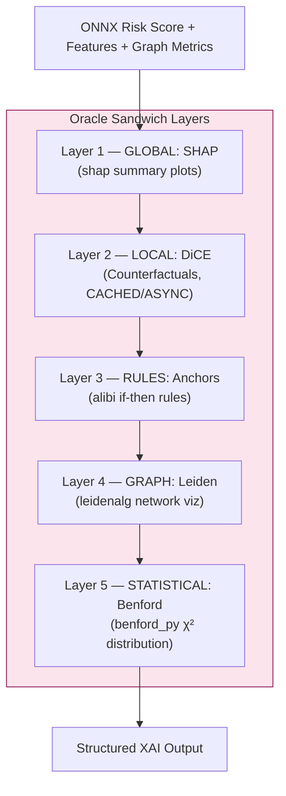

| Layer | Method | Library | Question Answered | SLA |
|-------|--------|---------|-------------------|-----|
| 1. Global | SHAP | `shap` | Which features matter most overall? | <2s |
| 2. Local | DiCE | `dice-ml` | What must change to NOT be flagged? | Async |
| 3. Rules | Anchors | `alibi` | What simple rule does the model follow? | <5s |
| 4. Graph | Leiden | `leidenalg` | Which companies form a cartel? | <3s |
| 5. Statistical | Benford | `benford_py` | Are bid prices statistically natural? | <1s (≥100 records pre-check required) |

---

## 7. Auto Report Generation

The report engine uses Jinja2 to generate IIA 2025 compliant reports in Bahasa Indonesia.

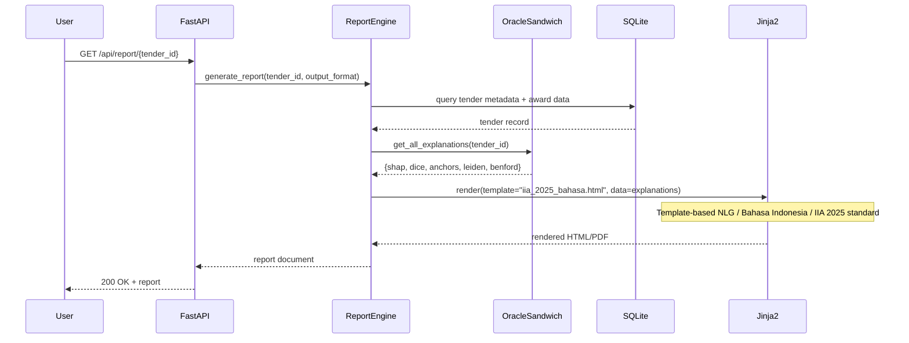

---

## 8. FastAPI Backend Architecture with Dynamic Injection

The FastAPI backend provides a RESTful interface for analysis and configuration injection.

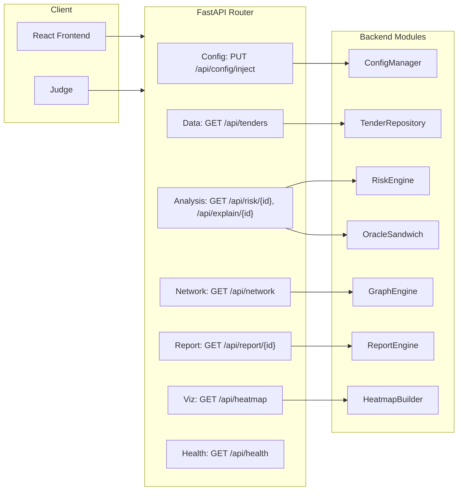

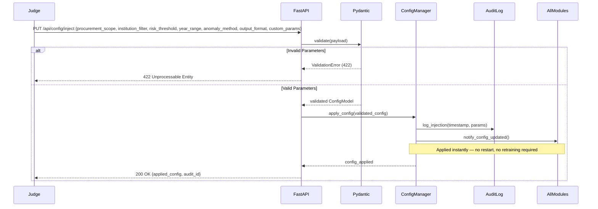

---

## 9. React Frontend with 5 Outputs

The frontend is a React Single Page Application (SPA) visualizing forensic findings through 5 specialized output components.

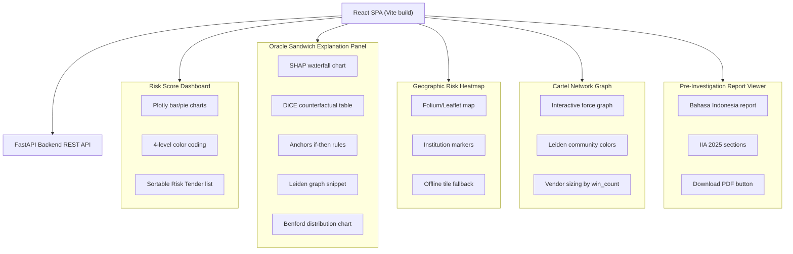

---

## 10. Runtime Config Flow

Configuration is managed as a thread-safe singleton, allowing for instant updates to all processing modules without service interruption.

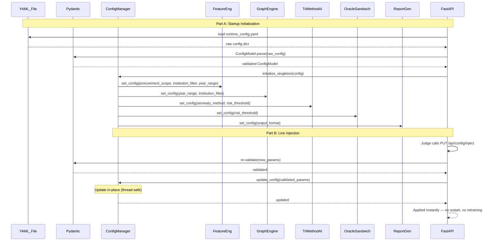

| Parameter | Controls | Module(s) Affected |
|-----------|----------|-------------------|
| `procurement_scope` | tender category filter | FeatureEng, GraphEngine, TenderRepository |
| `institution_filter` | K/L/Pemda filter | all data queries |
| `risk_threshold` | classification boundary | TriMethodAI, OracleSandwich |
| `year_range` | temporal filter | all data queries, temporal split |
| `anomaly_method` | Isolation Forest / XGBoost / ensemble | TriMethodAI |
| `output_format` | dashboard / API JSON / audit report | ReportGen, FastAPI responses |
| `custom_params` | wildcard dict for judge-injected unknown params | CustomParamsHandler |
