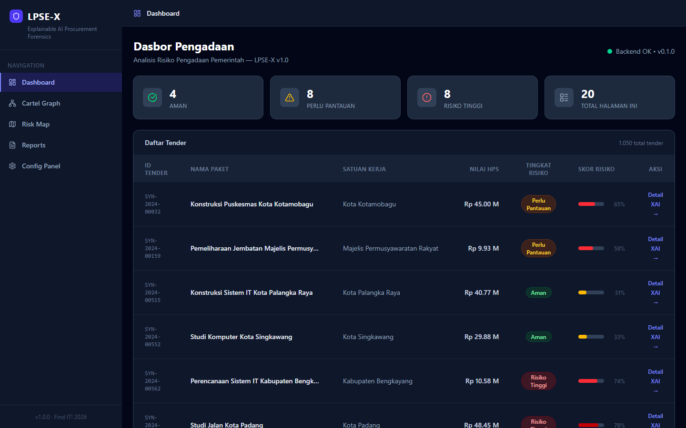
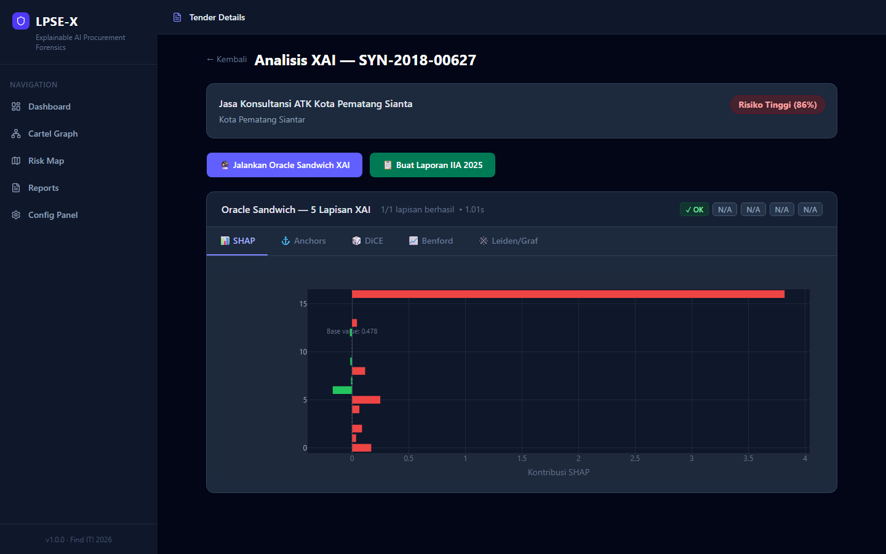
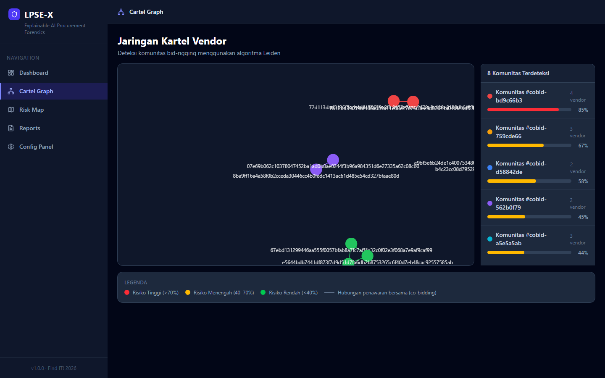
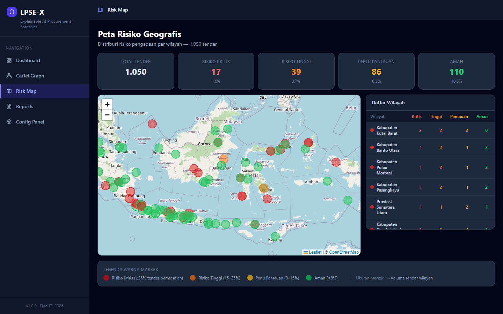
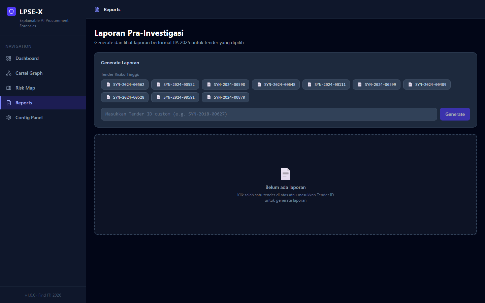
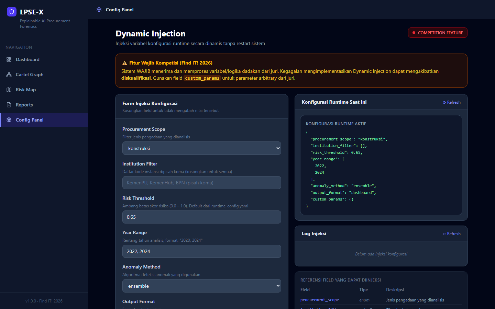

<div align="center">

# LPSE-X

### Platform Forensik Pengadaan Pemerintah Berbasis Explainable AI

[](https://findit.ugm.ac.id)
[](https://python.org)
[](https://react.dev)
[](https://fastapi.tiangolo.com)
[](LICENSE)

> **"The Explainable Oracle"** — Deteksi anomali pengadaan pemerintah yang **dapat menjelaskan setiap keputusannya** melalui 5 lapisan XAI independen. 100% offline. Zero cloud dependency.

</div>

---

## Screenshots

<table>
  <tr>
    <td width="50%">
      
      <p align="center"><b>Dashboard</b> — Tabel tender real-time dengan skor risiko, badge risk level, dan ScoreBar per baris</p>
    </td>
    <td width="50%">
      
      <p align="center"><b>Oracle Sandwich XAI</b> — 5-lapisan penjelasan: SHAP, Anchors, DiCE, Benford, Leiden</p>
    </td>
  </tr>
  <tr>
    <td width="50%">
      
      <p align="center"><b>Cartel Graph</b> — Jaringan co-bidding vendor dengan deteksi komunitas Leiden</p>
    </td>
    <td width="50%">
      
      <p align="center"><b>Risk Map</b> — Peta risiko geografis seluruh Indonesia dengan marker berwarna per level</p>
    </td>
  </tr>
  <tr>
    <td width="50%">
      
      <p align="center"><b>Reports</b> — Laporan pra-investigasi format IIA 2025, pre-generated per tender</p>
    </td>
    <td width="50%">
      
      <p align="center"><b>Config Panel</b> — Dynamic Injection runtime tanpa restart server (fitur wajib kompetisi)</p>
    </td>
  </tr>
</table>

---

## Apa itu LPSE-X?

LPSE-X adalah platform forensik pengadaan pemerintah yang mendeteksi potensi kecurangan tender menggunakan **Explainable AI (XAI)**. Berbeda dari sistem blackbox biasa, LPSE-X menjelaskan *mengapa* sebuah tender dicurigai melalui **Oracle Sandwich** — 5 lapisan analisis independen yang dapat dipertanggungjawabkan.

### Oracle Sandwich — 5 Lapisan XAI

| # | Layer | Metode | Output |
|---|-------|--------|--------|
| 1 | **SHAP** | Feature importance (Shapley values) | Fitur mana yang paling mendorong skor risiko |
| 2 | **Anchors** | Rule extraction | Aturan if-then yang dapat dijelaskan ke publik |
| 3 | **Benford's Law** | Digit distribution analysis | Deteksi manipulasi angka pada nilai HPS |
| 4 | **Leiden Graph** | Community detection | Jaringan kartel vendor co-bidding |
| 5 | **DiCE** | Counterfactual explanation | *"Jika nilai HPS turun 20%, risiko turun dari 86% ke 41%"* |

### Fitur Utama

| Fitur | Detail |
|-------|--------|
| 📊 **1.050 Tender** | Dianalisis real-time dengan skor risiko XGBoost + Isolation Forest ensemble |
| 🕸️ **8 Komunitas Kartel** | Terdeteksi via Leiden algorithm dari pola co-bidding vendor |
| 📋 **5 Laporan IIA 2025** | Pre-generated laporan pra-investigasi format standar audit internasional |
| 🔒 **100% Offline** | Zero API eksternal, berjalan dari satu folder, portable bundle |
| ⚡ **Dynamic Injection** | Ubah parameter runtime via `PUT /api/config/inject` tanpa restart server |
| 🔍 **Privacy by Design** | NPWP hanya disimpan sebagai SHA-256 hash + 4 digit terakhir |

---

## Tech Stack

<div align="center">

| Layer | Teknologi |
|-------|-----------|
| **Frontend** | React 18 · TypeScript · Vite · Tailwind CSS v4 · Plotly.js · Leaflet · react-force-graph |
| **Backend** | Python 3.11 · FastAPI · aiosqlite · Uvicorn |
| **ML / XAI** | XGBoost · Isolation Forest · SHAP · DiCE-ml · Anchor-Explanations |
| **Graph** | NetworkX · Leiden Algorithm (leidenalg) |
| **Database** | SQLite via aiosqlite (no ORM, raw SQL) |
| **Reports** | Jinja2 templates · IIA 2025 format |

</div>

---

## Struktur Proyek

```
lpse-x/
├── backend/
│   ├── api/routes/
│   │   ├── tenders.py        # GET /api/tenders, GET /api/tenders/{id}
│   │   ├── oracle.py         # POST /api/oracle/explain (5-layer XAI)
│   │   ├── reports.py        # GET/POST /api/reports/{tender_id}
│   │   ├── graph.py          # GET /api/graph/communities
│   │   └── config.py         # GET/PUT /api/config, GET /api/config/log
│   ├── ml/
│   │   ├── predict.py        # XGBoost + IForest ensemble predictor
│   │   └── features.py       # 82-feature extractor (ICW scoring methodology)
│   ├── config/
│   │   └── runtime.py        # Dynamic Injection — runtime config management
│   └── main.py               # FastAPI app entrypoint
├── frontend/
│   └── src/
│       ├── components/
│       │   ├── Layout.tsx    # Dark sidebar + navigation
│       │   └── ui/           # Card, Badge, Button, Skeleton, SectionHeader
│       └── pages/
│           ├── Dashboard.tsx     # Risk overview table
│           ├── TenderDetail.tsx  # Oracle Sandwich XAI detail
│           ├── CartelGraph.tsx   # Vendor network visualization
│           ├── RiskMap.tsx       # Geographic risk map
│           ├── Reports.tsx       # Pre-investigation reports
│           └── ConfigPanel.tsx   # Dynamic injection interface
├── data/
│   └── lpse_x.db             # SQLite: tenders(1050), predictions(1050), communities(8)
├── models/
│   ├── xgboost.ubj           # XGBoost model (pre-trained, seed=42)
│   └── iforest.pkl           # Isolation Forest model
└── scripts/
    ├── batch_predict.py      # Pre-compute predictions for all tenders
    ├── seed_cobidding.py     # Seed community co-bidding graph
    └── generate_reports.py   # Pre-generate IIA 2025 reports
```

---

## Instalasi & Menjalankan

### Prasyarat

- Python 3.11+
- Node.js 18+
- Windows / Linux / macOS

### Setup (satu kali)

```bash
# 1. Clone repository
git clone https://github.com/vaskoyudha/LPSE-X.git
cd LPSE-X/lpse-x

# 2. Setup Python environment
python -m venv .venv

# Windows
.venv\Scripts\activate

# Linux / macOS
source .venv/bin/activate

# Install dependencies
pip install -r requirements.txt

# 3. Build frontend
cd frontend
npm install
npm run build
cd ..
```

### Jalankan

```bash
# Start backend + frontend (auto port detection 8000–8099)
.venv\Scripts\python.exe start_lpse_x.py
```

Buka browser ke `http://localhost:<port>` (port ditampilkan di terminal).

> **Atau jalankan backend saja (development):**
> ```bash
> .venv\Scripts\python.exe -m uvicorn backend.main:app --port 8009 --reload
> cd frontend && npm run dev
> ```

---

## API Endpoints

| Method | Endpoint | Deskripsi |
|--------|----------|-----------|
| `GET` | `/api/health` | Health check + model status |
| `GET` | `/api/tenders` | List tender (pagination, filter by risk_level) |
| `GET` | `/api/tenders/{id}` | Detail tender + 82 features + prediction |
| `POST` | `/api/oracle/explain` | **Jalankan Oracle Sandwich** (5-layer XAI) |
| `GET` | `/api/graph/communities` | 8 komunitas kartel vendor |
| `GET` | `/api/reports/{tender_id}` | Generate laporan pra-investigasi IIA 2025 |
| `GET` | `/api/config` | Lihat konfigurasi runtime saat ini |
| `PUT` | `/api/config/inject` | **Dynamic Injection** — ubah parameter tanpa restart |
| `GET` | `/api/config/log` | Audit trail semua injeksi konfigurasi |

### Contoh: Dynamic Injection

```bash
curl -X PUT http://localhost:8009/api/config/inject \
  -H "Content-Type: application/json" \
  -d '{
    "risk_threshold": 0.5,
    "anomaly_method": "xgboost",
    "custom_params": {"judge_note": "review", "demo_mode": true}
  }'
```

### Contoh: Oracle Sandwich XAI

```bash
curl -X POST http://localhost:8009/api/oracle/explain \
  -H "Content-Type: application/json" \
  -d '{"tender_id": "SYN-2018-00627"}'
```

---

## Data & Model

### Database (`data/lpse_x.db`)

| Tabel | Rows | Deskripsi |
|-------|------|-----------|
| `tenders` | 1.050 | Data tender LPSE |
| `features` | 1.050 | 82 fitur per tender (ICW methodology) |
| `predictions` | 1.050 | Skor risiko XGBoost + IForest ensemble |
| `communities` | 8 | Komunitas vendor co-bidding (Leiden) |
| `reports` | 5 | Laporan pra-investigasi IIA 2025 |

### Distribusi Risiko

| Level | Count | % |
|-------|-------|---|
| 🔴 High | 196 | 18.7% |
| 🟡 Medium | 408 | 38.9% |
| 🟢 Low | 446 | 42.5% |

### Top-5 Tender Risiko Tertinggi

| Tender ID | Risk Score | Satuan Kerja |
|-----------|-----------|--------------|
| SYN-2018-00627 | **86.4%** | Kota Pematang Siantar |
| SYN-2024-00563 | **85.2%** | Kabupaten Sumba Timur |
| SYN-2018-00445 | **84.7%** | Kabupaten Bone Bolango |
| SYN-2022-00432 | **82.3%** | Kabupaten Ogan Komering Ulu Timur |
| SYN-2023-00074 | **81.9%** | Kementerian Pekerjaan Umum |

---

## Testing

```bash
# Jalankan semua tests
.venv\Scripts\python.exe -m pytest tests/ -v

# Tests spesifik
.venv\Scripts\python.exe -m pytest tests/test_tenders_api.py -v
.venv\Scripts\python.exe -m pytest tests/test_oracle.py -v
```

---

## Konteks Hackathon

**Event**: [Find IT! 2026](https://findit.ugm.ac.id) — Universitas Gadjah Mada  
**Track**: Track C — *"The Explainable Oracle"*

### Kriteria Penilaian

| Kriteria | Bobot | Implementasi LPSE-X |
|---------|-------|---------------------|
| **XAI Quality** | 40% | Oracle Sandwich: 5 lapisan independen (SHAP, Anchors, DiCE, Leiden, Benford) |
| **Completeness** | 30% | Pipeline penuh: data → feature extraction → ML → XAI → laporan IIA 2025 |
| **Offline Capability** | 20% | Zero cloud, single-folder bundle, auto port detection |
| **Code Quality** | 10% | Pytest suite, seed=42, no hardcoded params, audit trail, Privacy by Design |

### Privacy by Design

- **NPWP**: Hanya disimpan sebagai `SHA-256(npwp) + 4 digit terakhir` — tidak ada data mentah
- **Storage**: Semua data di SQLite lokal — tidak ada cloud, tidak ada API key eksternal
- **Audit Trail**: Setiap injeksi konfigurasi dicatat di `/api/config/log`

---

<div align="center">

*Dikembangkan untuk Find IT! 2026 — Universitas Gadjah Mada*

</div>
